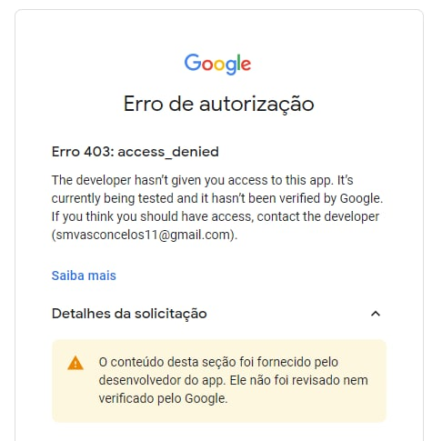

<h1 align="center">
	Vexpenses Contacts
</h1>

<p align="center">
	
</p>

<p align="center">
	
	
</p>

<h1 align="center">Desafios</h1>

- [x] Cadastro de contatos
- [x] Busca de endereço pelo CEP / API dos Correios
- [x] Exibição de feedback para usuário nos atos de cadastros e/ou falhas
- [x] Categorização / Agrupamento
- [x] Busca de contatos com sugestão de pesquisa
- [x] Possibilidade de muitos endereços e telefones por contato
- [x] Responsividade (funcionar desktop e mobile)
- [x] Validação em front-end dos formulários de cadastro
- [x] Login com google
- [x] Importar contatos do google contatos
- [x] Remoção de contatos
- [x] Edição de contatos

Por conta de como o sistema de validação do google funciona, é necessário adicionar os emails dos usuários que desejam realizar login nesta plataforma uma vez que o google limita o acesso de novas aplicações não verificadas. No momento esta plataforma foi enviada para analise, caso aprovado o login poderá ser realizado livremente.

<p align="center">

</p>

<h1 align="center"> Sobre </h1>
<p>
	Esta aplicação foi desenvolvida durante um processo seletivo para demonstrar algumas qualidades tecnicas de desenvolvimento.
	Foi utilizado React JS com typescript no seu desenvolvimento. O principal objetivo desta aplicação é permitir o gerenciamento de contatos dos usuários. Dentre suas funcionalidades de gerenciamentos foram desenvolvidas alguns requisitos extras como login com google e sincronização de contatos com o google contatos.
</p>


<h1 align="center"> Desenvolvimento </h1>
O desenvolvimento demorou por volta de 3 dias, e me proporcionou uma nova camada de aprendizado uma vez que não existia muita familiaridade com a api de login do google e de contatos. No geral foi aplicado uma estrutura padrão de organização, utilizando sempre a modularização de componentes e em suas estilizações foi utilizado o styled como pacote de auxilio.


<h1 align="center"> Como Usar </h1>

```
- Clone esse repositório:
$ git clone https://github.com/smvasconcelos/vexpenses-contatcs.git

- Entre no diretório:
$ cd vexpenses-contatcs

- Instale as dependências:
$ yarn

- Configure o arquivo de ambiente com a chave da api da google
$ REACT_APP_GOOGLE_CLIENT_ID

- Configure o arquivo com as informações do firebase
$ src/config/firebase.ts

- Inicie o app:
$ yarn start
```
Ou caso deseje acessar uma versão já configurada a aplicação está disponível no seguinte endereço: https://smvasconcelos.github.io/vexpenses-contatcs/.
